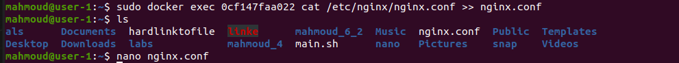
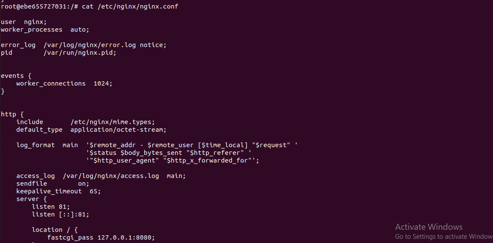
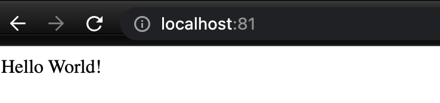
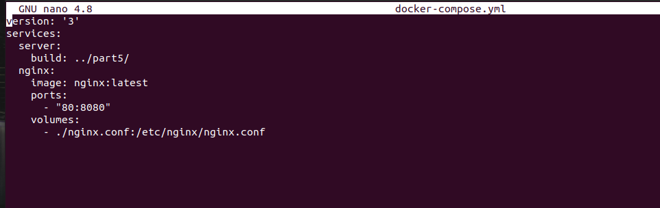

# Simple Docker

## Part 1. Ready-made docker
* Взять официальный докер образ с nginx и выкачать его при помощи `docker pull`

* Далее удостоверимся в наличии образа через команду `docker images`

* Наконец, запустим docker-образ через команду `docker run -d [image_id|repository]`

* Проверить, что образ запустился через `docker ps`

* Теперь посмотрим информацию о контейнере через командy `docker inspect [container_id|container_name]`

* Выведем размер контейнера

* И, наконец, IP контейнера

* Остановить докер образ через `docker stop [container_id|container_name]`

* Запустить докер с портами 80 и 443 в контейнере, замапленными на такие же порты на локальной машине, через команду *run*

* Удостоверимся, что все работает, открыв в браузере страницу по адресу *localhost*

* Наконец, перезапустим контейнер через команду `docker restart [container_id|container_name]` и проверим, что контейнер снова запустился командой `docker ps`

## Part 2. Operations with container

* Прочитать конфигурационный файл *nginx.conf* внутри докер контейнера через команду *exec*

    * При помощи `sudo docker exec [container_id] find -name "nginx.conf"` получил путь к `nginx.conf`

    * После при помощи `sudo docker exec [container_id] cat /etc/nginx/nginx.conf` получил содержимое файла
    
    

* Создать на локальной машине файл *nginx.conf*

    * При помощи `docker exec [container_id] cat /etc/nginx/nginx.conf >> nginx.conf` содержимое файла контейнера было перенесено в файл `nginx.conf` локальной машины.
    
    

* Настроить в нем по пути */status* отдачу страницы статуса сервера **nginx**

    * В блоке `http` был определен сервер с местоположением `/status`, который выполняет инструкцию `stub_status` (предоставляет мониторинг текущей активности сервера: количество активных соединений, запросов в секунду и т.д).
    * Строка `include /etc/nginx/conf.d/*.conf` была закомментирована.

* Скопировать созданный файл *nginx.conf* внутрь докер образа через команду `docker cp`

    * Копирование созданного файла `nginx.conf` внутрь докер образа было произведено при помощи `docker cp :nginx.conf [container_id]:/etc/nginx/`.
    
    * И перезапустим nginx внутри docker-образа командой `docker exec [container_id|container_name] nginx -s reload`

* Убедимся, что все работает, проверив страницу по адресу `localhost/status`

* Теперь экспортируем наш контейнер в файл `container.tar` командой `docker export`

* Затем удалим образ командой `docker rmi -f [image_id|repository]`, не удаляя перед этим контейнеры

* После чего удалим остановленный контейнер командой `docker rm [container_id|container_name]`

* Теперь импортируем контейнер обратно командой `docker import`

* `Dicker run`

* Проверить, что по адресу *localhost:80/status* отдается страничка со статусом сервера **nginx**

## Part 3. Mini web server

Чтобы создать свой мини веб-сервер, необходимо создать .c файл, в котором будет описана логика сервера (в нашем случае - вывод сообщения `Hello World!`), а также конфиг `nginx.conf`, который будет проксировать все запросы с порта 81 на порт 127.0.0.1:8080

* Теперь выкачаем новый docker-образ и на его основе запустим новый контейнер

* Перенес файлы server.c и nginx.conf в контейнер

* Для облегчения работы с контейнером подключился к его терминалу при помощи `sudo docker exec -it [container_id] /bin/bash`

* Убеждаюсь в том, что сервер и конфигурационный файл были пернесены в контейнер

* Обновив контейнер установил gcc, spawn-fcgi, libfcgi-dev

* Скомпилировал сервер при помощи `gcc /home/server.c -lfcgi -o server`

* Запустил написанный сервер при помощи `spawn-fcgi -p 8080 ./home/server`

* Чтобы удостовериться, что все работает корректно, проверим, что в браузере по адресу `localhost:81` отдается написанная нами страница

## Part 4. Your own docker

* Написать свой докер образ, который:
    * 1) собирает исходники мини сервера на FastCgi из Части 3
    * 2) запускает его на 8080 порту
    * 3) копирует внутрь образа написанный *./nginx/nginx.conf*
    * 4) запускает **nginx**.

    * `Dockerfile` находится в `part4/Dockerfile`.

* Собрать написанный докер образ через `docker build` при этом указав имя и тег

* Теперь удостоверимся, что все собралось, проверив наличие соответствующего образа командой `docker images`

* После запустим собранный docker-образ с мапингом порта `81` на порт `80` локальной машины, а также мапингом папки `./nginx` внутрь контейнера по адресу конфигурационных файлов nginx'а, и проверим, что страничка написанного сервера по адресу

* Проверить, что по localhost:80 доступна страничка написанного мини сервера

* Дописать в *./nginx/nginx.conf* проксирование странички */status*, по которой надо отдавать статус сервера **nginx**

* Перезапустить докер образ
*Если всё сделано верно, то, после сохранения файла и перезапуска контейнера, конфигурационный файл внутри докер образа должен обновиться самостоятельно без лишних действий*
* Проверить, что теперь по *localhost:80/status* отдается страничка со статусом **nginx**

## Part 5. **Dockle**

* Просканировать образ из предыдущего задания через `dockle [image_id|repository]`

    * Установил `dockle` с официального репозитория.

        * `curl -L -o dockle.deb https://github.com/goodwithtech/dockle/releases/download/v0.4.13/dockle_0.4.13_Linux-64bit.deb`
        * `sudo dpkg -i dockle.deb && rm dockle.deb`
    * При помощи `sudo dockle docker:1` получил отчет об ошибках, предупреждениях и информации о сомнительных моментах.

* Исправить образ так, чтобы при проверке через **dockle** не было ошибок и предупреждений
    * Самую первую ошибку выдает образ `nginx:latest`. Свой обрз решил собрать образе чистого `ubuntu:20.04`, при этом добавив к `apt-get install` установку `nginx`
    * Вторую ошибку исправил удалением кеша `apt-get` после установки всех необходимых компонентов
    * Суть предупреждения заклчалась в отсутствие юзера, который в конечном итоге бы выполнял инструкции докерфайла. По дефолту инструкции выполнял `root` пользователь, что не совсем безопасно. Для решения создал нового пользователя и дал ему права доступа для всех директорий, которые будут затронуты при выполнении инструкций скрипта `run.sh`, после переключился на нового пользователя.
    * Информацию о возможных нарушениях убрал не всю, этого и не требовало задание.

## Part 6. Basic Docker Compose

* Написать файл *docker-compose.yml*, с помощью которого:
    * 1) Поднять докер контейнер из [Части 5](#part-5-инструмент-dockle) _(он должен работать в локальной сети, т.е. не нужно использовать инструкцию **EXPOSE** и мапить порты на локальную машину)_
    * 2) Поднять докер контейнер с **nginx**, который будет проксировать все запросы с 8080 порта на 81 порт первого контейнера
* Замапить 8080 порт второго контейнера на 80 порт локальной машины
* Собрать и запустить проект с помощью команд `docker-compose build` и `docker-compose up`
    * Сборка прошла успешно
    
    

